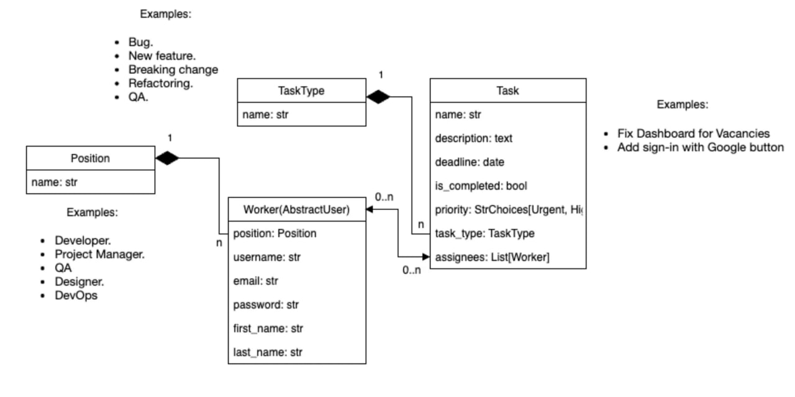
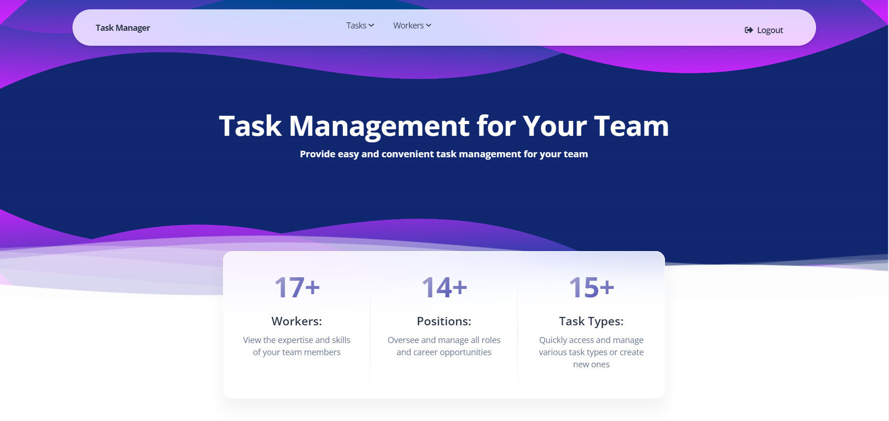
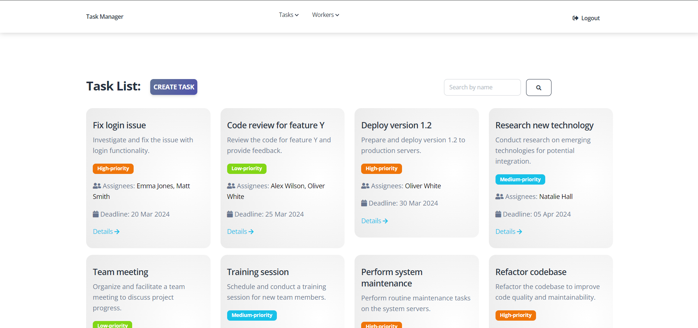
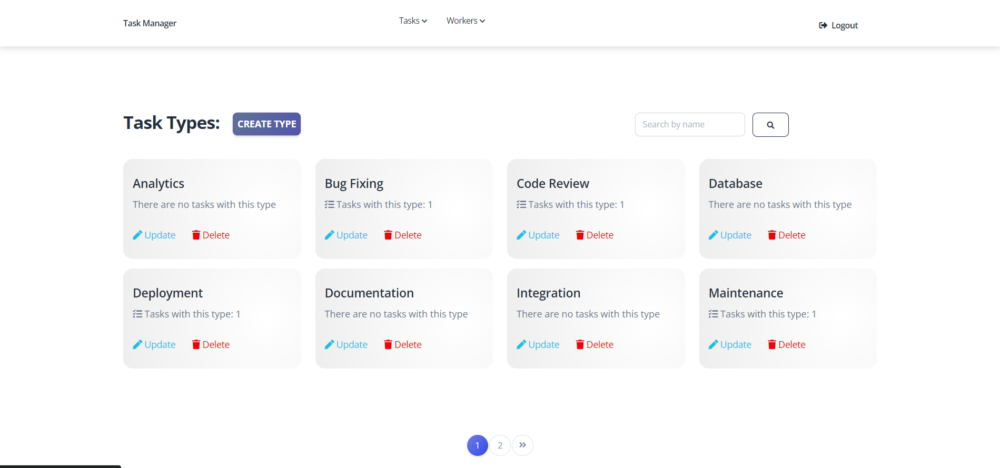
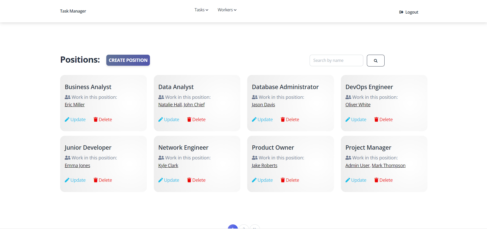
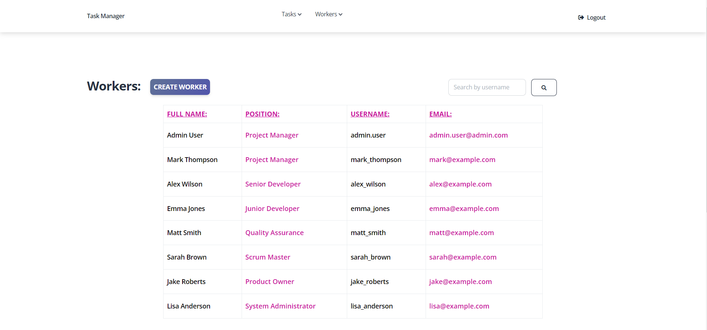
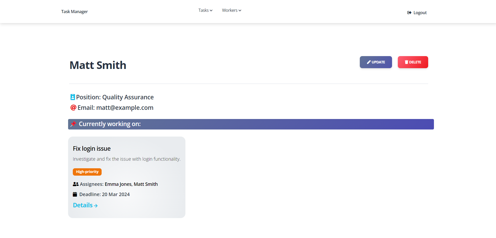
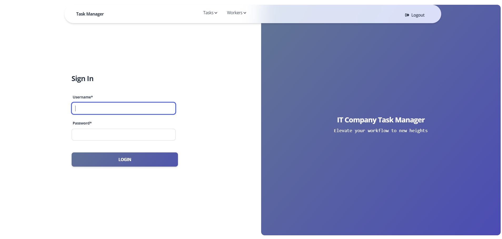

# IT-Company-Task-Manager

## Installation

Run the following code in terminal:

```shell
git clone https://github.com/daikj88/it-company-task-manager.git
cd it-company-task-manager
python -m venv venv
source venv/bin/activate (for MacOS)
venv\Scripts\activate (for Windows)
pip install -r requirements.txt
python manage.py runserver 
```

### For testing with data

- Use this command to load prepared data from the fixture:

`python manage.py loaddata task_manager_db.json`

- After loading data from the fixture you can use the following superuser:

```
login: admin.user
password: 1qazcde3
```

### DB structure:

### Home page:

### Task list:

### Task type:

### Positions:

### Workers:

### Worker detail:

### Login page:

